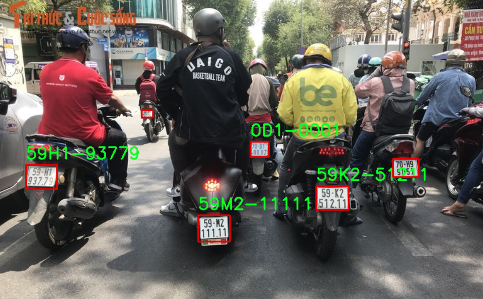
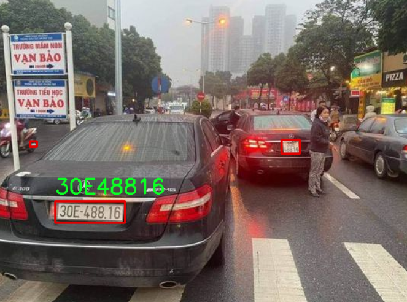
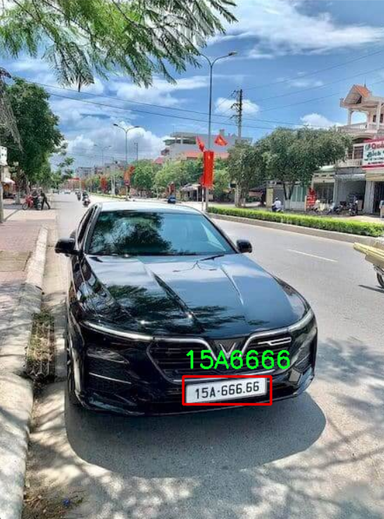

# NhanDangBienSoXe_TGMT

## Installation

```bash
  git clone https://github.com/Merc7803/NhanDangBienSoXe_TGMT.git
  cd NhanDangBienSoXe_TGMT/License_Plate

  # install dependencies
  pip install -r ./requirement.txt
```

- **Yolov5:** The project uses yolov5, you can download yolov5 here: [yolov5](https://github.com/ultralytics/yolov5)

- **Datasets:** The project uses 2 datasets: [License Plate Detection Dataset](https://drive.google.com/drive/folders/1EV0DgCJwTaBiynT7FdFsGcb5Cc7-ij33?usp=sharing) and [Character Detection Dataset](https://drive.google.com/drive/folders/14UWCrJZk66J_hKLnN9l8kQWmUbf4bumG?usp=sharing)

## How to run
```bash
  # run on webcam
  python webcam.py 
 
  # run on an image (example)
  python lp_image.py -i test_image_video/2.jpg

  # run on a video (example)
  python video.py -v test_image_video/video_1.mp4
```

## Result



